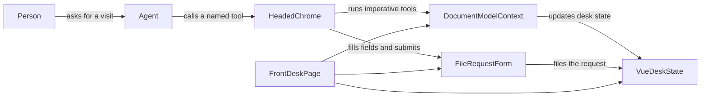
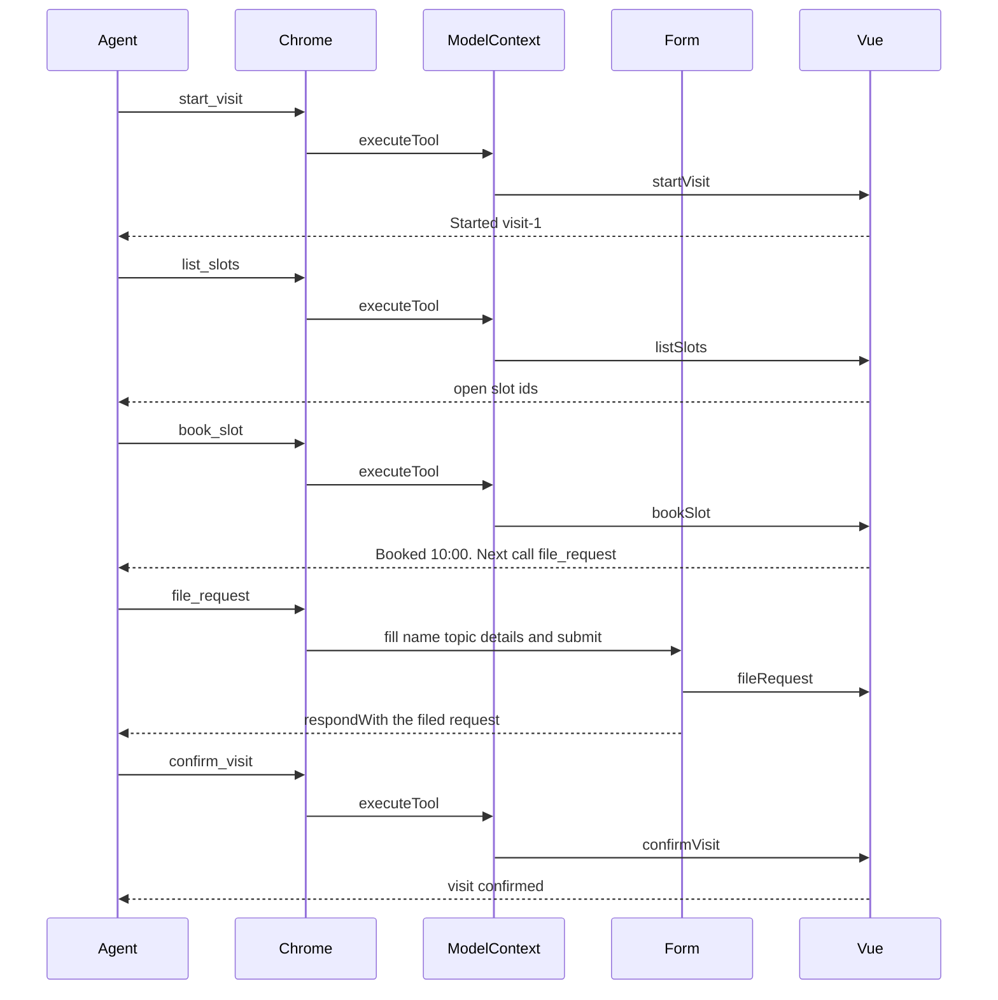

# Front desk

A browser agent does not click around this page at random. The page offers named tools. Headed Chrome shows those tools to the agent and brings the results back. Vue only draws the desk.

This page is an explanation of that split. To run the demo, use the commands in the root [README](../../README.md).

## Who talks to whom

The person asks for a visit. The agent calls tools. Chrome is the broker. The page never talks to the agent directly.

`DocumentModelContext` is `document.modelContext`. The page registers four tools there from `register-tools.ts`. The fifth tool is the form itself.

Vue holds the visit, the slot list, and the request list. It does not register tools, and it does not bind the request fields with `v-model`. If it did, the next render would overwrite values Chrome had just written into the form.

## Two ways a tool is born

| Tool            | How the page creates it                      | What Chrome does                                                     |
| --------------- | -------------------------------------------- | -------------------------------------------------------------------- |
| `start_visit`   | `registerTool` in `register-tools.ts`        | Calls the JavaScript function                                        |
| `list_slots`    | `registerTool` in `register-tools.ts`        | Calls the JavaScript function                                        |
| `book_slot`     | `registerTool` in `register-tools.ts`        | Calls the JavaScript function with `slotId`                          |
| `confirm_visit` | `registerTool` in `register-tools.ts`        | Calls the JavaScript function                                        |
| `file_request`  | `toolname` on the form in `request-form.vue` | Focuses the form, fills `name`, `topic`, and `details`, then submits |

The form also has `tooldescription` and `toolautosubmit`. `toolautosubmit` tells Chrome to submit after it fills the fields. The submit handler in `bind-request-form.ts` calls `preventDefault`, reads the fields from the form, and calls `respondWith` so the agent receives a sentence instead of a navigation.

## A successful visit

Call the tools in this order. A later tool returns `ERROR:` and names the tool to call first if you skip ahead.

After `book_slot`, the Appointments list shows a booked line such as `10:00 booked`. After `file_request`, the Requests list shows the filed request. Those visible lines are what the checker waits for.

If `document.modelContext` is missing, the page still paints the desk. It sets `data-webmcp="missing"` and the status text `WebMCP is not available in this browser.`

## Words used here

**Tool.** A named action the agent can call. This page has five.

**`document.modelContext`.** The browser object the page uses to register imperative tools, and the object an agent uses to list and run them.

**Imperative tool.** A tool created with `registerTool`. The page supplies the function.

**Declarative tool.** A tool created by attributes on a real HTML form. This page has one, `file_request`.

**`respondWith`.** The method on the form `submit` event that returns the tool result to the agent. Call it only after `preventDefault`.

**Agent.** The caller of the tools. In this demo that is headed Chrome with WebMCP enabled, or the checker in `packages/webmcp-check`.

## Further reading

Chrome documents the protocol. These pages are the reference. This README does not repeat them.

- [WebMCP overview](https://developer.chrome.com/docs/ai/webmcp)
- [Imperative API](https://developer.chrome.com/docs/ai/webmcp/imperative-api)
- [Declarative API](https://developer.chrome.com/docs/ai/webmcp/declarative-api)
- [WebMCP versus MCP](https://developer.chrome.com/docs/ai/webmcp/compare-mcp)
- [Use cases](https://developer.chrome.com/docs/ai/webmcp/use-cases)
- [Build tools](https://developer.chrome.com/docs/ai/webmcp/build-tools)
- [Secure tools](https://developer.chrome.com/docs/ai/webmcp/secure-tools)
- [Best practices](https://developer.chrome.com/docs/ai/webmcp/best-practices)
- [Evals](https://developer.chrome.com/docs/ai/webmcp/evals)
